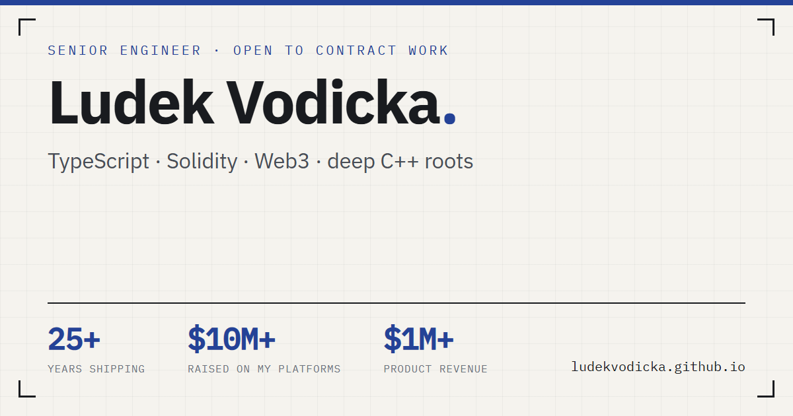

# ludekvodicka.github.io

My portfolio site, live at **[ludekvodicka.github.io](https://ludekvodicka.github.io)**. Hand-built
with no framework, no template and no build step - what you see in this repo is exactly what the
server sends.



## The site

| URL | Content |
|---|---|
| [/](https://ludekvodicka.github.io/) | Home - three numbered catalogues of things you can install (01 Apps, 02 Tools, 03 Libraries), plus contact |
| [/cv.html](https://ludekvodicka.github.io/cv.html) | The engineering dossier - work grid, open source, security, an animated system diagram, stack, toolbox word cloud, how I work, journey, hiring, contact |
| `/apps/<slug>.html` | A page per app - hero screenshot, what it does, more screenshots, download buttons. Seven pages: `jamat`, `screenmcp`, `meetingrecorder`, `vifito-desktop`, `localgate`, `vscode-tortoise-git`, `vscode-tortoise-svn` |
| `/cv-print.html` | A4 print sheet the CV PDF is rendered from - `noindex`, unlinked |

## How it's built

- **No framework, no bundler, no build step.** Plain HTML + CSS + vanilla JavaScript. The only
  external scripts are d3 + d3-cloud from a CDN, loaded on the CV page alone for the word cloud.
- **All content is data.** Every list, card and diagram is driven by `assets/js/data.js`;
  `assets/js/main.js` renders the pages and `assets/js/cv.js` fills the print sheet from the same
  data. Design tokens sit at the top of `assets/css/styles.css` under `:root`.
- **Small touches that took real work:** the installer buttons ship as plain links to GitHub
  releases, then a background fetch upgrades them to the actual installer for each platform with
  version and size - it never blocks first paint and fails silently. `prefers-reduced-motion` is
  honoured, animation pauses when the tab is hidden, and there is a `noscript` fallback.

## Run it locally

It is a static site - any file server works:

```bash
python -m http.server 8080
```

Then open <http://localhost:8080>. Don't open the files via `file://` - the app pages use
root-absolute paths.

The committed CV PDF and the WebP screenshots are produced by development tools that live outside
this repo; nothing in here needs a build to run.

## Copyright

Code and content © Ludek Vodicka. All rights reserved.

This repo is public so the code can be read, not so the site can be redeployed under another name.
Feel free to borrow the techniques; the files themselves - the CV texts, images and PDF - are
personal content and stay mine.
